# **Лабораторная работа 1**
## Задание 1
```
name=input()
age=int(input())
print("Привет,"+name+" через год тебе будет "+(str((age+1))))
```
 
## Задание 2
```
a=input("a: ").replace(",",".")
b=input("b: ").replace(",",".")
a=float(a)
b=float(b)
s=a+b
avg=s/2
print(s,avg)
```

## Задание 3
```
price=float(input("price: "))
discount=float(input("discount: "))
vat=float(input("vat: "))
baza=price*(1-discount/100)
nds=baza*(vat/100)
itog=baza+nds
print("База: "+(str(baza)))
print("НДС: "+(str(nds)))
print("Итог: "+(str(itog)))
```

## Задание 4
```
m=int(input())
ch=m//60
mm=m%60
print(f"{ch}:{(mm-60*ch):02d}")
```

## Задание 5
```
name=input("ФИО: ").strip()
part=name.split()
length=len(''.join(part))+2
ini=''.join([i[0].upper() for i in part])
print(f"Инициалы: {ini}")
print(f"Длина (символов): {length}")
```


# **Лабораторная работа 2**
## Задание 1
```
a = [3, -1, 5, 5, 0]
b = [3, 1, 2, 1, 3]
c = [[1, 2], [3, 4]]
mat2 = []
def min_max(nums: list[float | int]) -> tuple[float | int, float | int]:
    if not nums:
        return ValueError
    return (min(nums), max(nums))

def unique_sorted(nums: list[float | int]) -> tuple[float | int, float | int]:
    if not nums:
        return ValueError
    return (sorted(set(nums)))

def flatten(mat: list[list | tuple]) -> list:
    if not nums:
        return ValueError
    for el in mat:
        mat2.extend(el)
    return(mat2)

```

## Задание 2 (1b)
```
def transpose(mat: list[list[float | int]]) -> list[list]:
    if not mat:
        return []
    row_length = len(mat[0])
    for i, row in enumerate(mat):
        if len(row) != row_length:
            return ValueError
    result = []
    for cl in range(len(mat[0])):
        new_row = []
        for row in range(len(mat)):
            new_row.append(mat[row][cl])
        result.append(new_row)
    return result
print(transpose([[1, 2, 3]]))
print(transpose([[1], [2], [3]]))
print(transpose([[1, 2], [3, 4]]))
print(transpose([]))
print(transpose([[1, 2], [3]]))

def row_sums(mat: list[list[float | int]]) -> list[float]:
    if not mat:
        return []
    row_length = len(mat[0])
    for i, row in enumerate(mat):
        if len(row) != row_length:
            return ValueError
    result = []
    for row in mat:
        result.append(sum(row))
    return result
print(row_sums([[1, 2, 3], [4, 5, 6]]))
print(row_sums([[-1, 1], [10, -10]]))
print(row_sums([[0, 0], [0, 0]]))
print(row_sums([[1, 2], [3]]))

def col_sums(mat: list[list[float | int]]) -> list[float]:
    if not mat:
        return []
    row_length = len(mat[0])
    for i, row in enumerate(mat):
        if len(row) != row_length:
            return ValueError
    result = []
    for col in range(len(mat[0])):
        col_sum = 0
        for row in range(len(mat)):
            col_sum += mat[row][col]
        result.append(col_sum)
    return result
print(col_sums([[1, 2, 3], [4, 5, 6]]))
print(col_sums([[-1, 1], [10, -10]]))
print(col_sums([[0, 0], [0, 0]]))
print(col_sums([[1, 2], [3]]))
```

## Задание 3
```
from typing import Tuple

StudentRecord = Tuple[str, str, float]

def format_record(rec: StudentRecord) -> str:
    if len(rec) != 3:
        raise ValueError
    fio, group, gpa = rec
    if not isinstance(gpa, (int, float)):
        raise ValueError
    if gpa < 0 or gpa > 5:
        raise ValueError
    fio_parts = [part.strip() for part in fio.split()]
    if len(fio_parts) < 2:
        raise ValueError
    formatted_surname = fio_parts[0].capitalize()
    initials = ''.join([f'{name[0].upper()}.' for name in fio_parts[1:]])
    formatted_gpa = f'{gpa:.2f}'
    formatted_record = f"{formatted_surname} {initials}, гр. {group}, GPA {formatted_gpa}"
    return formatted_record
```


# **Лабораторная работа 3**
## Задание A (normalize)
```
def normalize(text: str, *, casefold: bool = True, yo2e: bool = True) -> str:
    text = text.casefold()
    if yo2e:
        text = text.replace('ё', 'е').replace('Ё', 'Е')
    text = text.replace('\t', ' ').replace('\r', ' ').replace('\n', ' ')
    text = ' '.join(text.split())
    text = text.strip()
    return text
print(normalize("ПрИвЕт\nМИр\t")) 
print(normalize("ёжик, Ёлка"))
print(normalize("Hello\r\nWorld"))
print(normalize("  двойные   пробелы  "))
```

## Задание А (tokenize)
```
import re 
def tokenize(text: str) -> list[str]:
    return re.findall(r'\w+(?:-\w+)*', text)
print(tokenize("привет мир"))
print(tokenize("hello,world!!!"))
print(tokenize("по-настоящему круто"))
print(tokenize("2025 год"))
print(tokenize("emoji 😀 не слово"))
```

## Задание А (count_freq + top_n)
```
def count_freq(tokens: list[str]) -> dict[str, int]:
    c = {}  
    for w in tokens:
        cu = c.get(w, 0)
        c[w] = cu + 1
    return c
def top_n(freq: dict[str, int], n: int = 5) -> list[tuple[str, int]]:
    t = []
    for w, count in freq.items():
        t.append((-count, w))
    t.sort()
    result = []
    for neg_count, w in t:
        result.append((w, -neg_count))
    return result[:n]
tok = ["a", "b", "a", "c", "b", "a"]
freq = count_freq(tok)
print(top_n(freq, n=2))
tok_2 = ["bb", "aa", "bb", "aa", "cc"]
freq_2 = count_freq(tok_2)
print(top_n(freq_2, n=2))
```

## Задание B
```
from lib.text import normalize, tokenize, count_freq, top_n
import sys
def main():
    text = sys.stdin.buffer.read().decode('utf-8') #вход к бинарным данным,преобразует строку в юникод
    if not text.strip():
        print("Нет входных данных")
        return
    normalized_text = normalize(text)
    tokens = tokenize(normalized_text)
    

    if not tokens:
        print("В тексте не найдено слов")
        return

    total_words = len(tokens) # общее количество слов
    freq_dict = count_freq(tokens) # словарь частот
    unique_words = len(freq_dict) # количеситво уникальных слов 
    top_words = top_n(freq_dict, 5) # самые популярные частоты
    
    print(f"Всего слов: {total_words}")
    print(f"Уникальных слов: {unique_words}")
    print("Топ-5:")
    for word, count in top_words:
        print(f"{word}: {count}")


if __name__ == "__main__":  
    main()
```


# **Лабораторная работа 4**
## Задание A
```
import csv
from pathlib import Path
from typing import Iterable, Sequence

def read_text(path: str | Path, encoding: str = "utf-8") -> str:
    try:
        return Path(path).read_text(encoding=encoding)
    except FileNotFoundError:
        return "Такого файла нету"
    except UnicodeDecodeError:
        return "Неудалось изменить кодировку"

def write_csv(rows: list[tuple | list], path: str | Path, header: tuple[str, ...] | None = None) -> None:
    p = Path(path)
    with p.open('w', newline="", encoding="utf-8") as file: # контроль переноса строк,кодироввка файла
        f = csv.writer(file)
        if header is None and rows == []: # нет заголовка и данных
            file_c.writerow(('a', 'b')) 
        if header is not None:
            f.writerow(header)
        if rows != []:
            const = len(rows[0])
            for i in rows:
                if len(i) != const:
                    return ValueError
        f.writerows(rows)

def ensure_parent_dir(path: str | Path) -> None:
    Path(path).parent.mkdir(parents=True, exist_ok=True)

print(read_text(r"C:\Users\Home\Documents\GitHub\lab_01\data\input.txt"))
write_csv([("word","count"),("test",3)], r"C:\Users\Home\Documents\GitHub\lab_01\data\check.csv")
```

## Задание B
```
from io_txt_csv import read_text, write_csv, ensure_parent_dir
import sys
from pathlib import Path

sys.path.append(r'C:\Users\Home\Documents\GitHub\lab_01\lib')

from text import normalize, tokenize, count_freq, top_n


def exist_path(path_f: str):
    return Path(path_f).exists() #существует ли файл 


def main(file: str, encoding: str = 'utf-8'): 
    if not exist_path(file):
        raise FileNotFoundError 
    
    file_path = Path(file)
    text = read_text(file, encoding=encoding) # текст в одну строку
    norm = normalize(text) 
    tokens = tokenize(norm)
    freq_dict = count_freq(tokens)
    top = top_n(freq_dict, 5)
    top_sort = sorted(top, key=lambda x: (x[1], x[0]), reverse=True) # сортирует список, критерии сортировки, частота слово и само слово, сортировка по убыванию
    report_path = file_path.parent / 'report.csv' # cоздает путь для файла отчета в той же папке, где исходный файл
    write_csv(top_sort, report_path, header=('word', 'count'))
    
    print(f'Всего слов: {len(tokens)}')
    print(f'Уникальных слов: {len(freq_dict)}')
    print('Топ-5:')
    for cursor in top_sort:
        print(f'{cursor[0]}: {cursor[-1]}')


main(r'C:\Users\Home\Documents\GitHub\lab_01\data\input.txt')
```

# **Лабораторная работа 5**
## Задание A
```
def json_to_csv(json_path: str, csv_path: str) -> None:

    json_file = Path(json_path)
    csv_file = Path(csv_path)
    
    if not json_file.exists():
        raise FileNotFoundError(f"Файл {json_path} не найден")
    
    if json_file.suffix.lower() != '.json':
        raise ValueError("Неверный тип файла. Ожидается .json")
    
    try:
        with json_file.open('r', encoding='utf-8') as f:
            data = json.load(f)
    except json.JSONDecodeError as e:
        raise ValueError(f"Ошибка чтения JSON: {e}")
    
    if not data:
        raise ValueError("Пустой JSON или неподдерживаемая структура")
    
    if not isinstance(data, list):
        raise ValueError("JSON должен содержать список объектов")
    
    if not all(isinstance(item, dict) for item in data):
        raise ValueError("Все элементы JSON должны быть словарями")
    
    all_keys = set()
    for item in data:
        all_keys.update(item.keys())

    if data:
        first_item_keys = list(data[0].keys())
        remaining_keys = sorted(all_keys - set(first_item_keys))
        fieldnames = first_item_keys + remaining_keys
    else:
        fieldnames = sorted(all_keys)
    # Запись в CSV
    try:
        with csv_file.open('w', newline='', encoding='utf-8') as f:
            writer = csv.DictWriter(f, fieldnames=fieldnames)
            writer.writeheader()
            for row in data:
                complete_row = {key: row.get(key, '') for key in fieldnames}
                writer.writerow(complete_row)
    except Exception as e:
        raise ValueError(f"Ошибка записи CSV: {e}")

def csv_to_json(csv_path: str, json_path: str) -> None:
  
    csv_file = Path(csv_path)
    json_file = Path(json_path)
    
    if not csv_file.exists():
        raise FileNotFoundError(f"Файл {csv_path} не найден")

    if csv_file.suffix.lower() != '.csv':
        raise ValueError("Неверный тип файла. Ожидается .csv")
    
    try:
        with csv_file.open('r', encoding='utf-8') as f:
            reader = csv.DictReader(f)
            if reader.fieldnames is None:
                raise ValueError("CSV файл не содержит заголовка")
            
            data = list(reader)
            
    except Exception as e:
        raise ValueError(f"Ошибка чтения CSV: {e}")

    if not data:
        raise ValueError("Пустой CSV файл")

    try:
        with json_file.open('w', encoding='utf-8') as f:
            json.dump(data, f, ensure_ascii=False, indent=2)
    except Exception as e:
        raise ValueError(f"Ошибка записи JSON: {e}")

json_to_csv('scr/data/samples/people.json', 'scr/data/out/people_from_json.csv')
csv_to_json('scr/data/samples/people.csv', 'scr/data/out/people_from_csv.json')
```


## Задание B
```
from pathlib import Path
from openpyxl import Workbook

def csv_to_xlsx(csv_path: str, xlsx_path: str) -> None:
    """
    Конвертирует CSV в XLSX.
    Использует openpyxl.
    Первая строка CSV — заголовок.
    Лист называется "Sheet1".
    Колонки — автоширина по длине текста (не менее 8 символов).
    """
    csv_file = Path(csv_path)
    xlsx_file = Path(xlsx_path)

    if not csv_file.is_file():
        raise FileNotFoundError(f"File {csv_path} not found")

    with csv_file.open(encoding='utf-8', newline='') as f:
        reader = csv.reader(f)
        data = list(reader)

    if len(data) == 0:
        raise ValueError("CSV file is empty")

    wb = Workbook()
    ws = wb.active
    ws.title = "Sheet1"

    for row in data:
        ws.append(row)

    for col_idx, col_cells in enumerate(ws.columns, start=1):
        max_length = max(len(str(cell.value)) if cell.value is not None else 0 for cell in col_cells)
        adjusted_width = max(max_length, 8)
        col_letter = ws.cell(row=1, column=col_idx).column_letter
        ws.column_dimensions[col_letter].width = adjusted_width

    wb.save(xlsx_file)
    
csv_to_xlsx('scr/data/samples/people.csv', 'scr/data/out/people.xlsx')
```


# **Лабораторная работа 6**
## Cli_text
```
import argparse
from pathlib import Path
from src.lib.text import tokenize, count_freq, top_n

def main():
    parser = argparse.ArgumentParser(description="CLI-утилиты лабораторной №6")
    subparsers=parser.add_subparsers(dest="command", help="Доступные соманды")

    stats_parser = subparsers.add_parser("stats",help="Частоты слов в тексте")
    stats_parser.add_argument("--input", required=True, help="Входной текстовый файл")
    stats_parser.add_argument("--top", type=int,default=5,help="Количество топовых слов "
    "(по умолчанию: 5)")

    cat_parser=subparsers.add_parser("cat", help="Вывод содержимого файла")
    cat_parser.add_argument("--input", required=True, help="Путь к входному файлу")
    cat_parser.add_argument("-n",action="store_true", help="Нумеровать строки")

    args = parser.parse_args()

    file=Path(args.input)

    if not file.exists():
        raise FileNotFoundError("Файл не найден")


    if args.command == "cat":

        with open(file, "r", encoding="utf-8") as f:
            number=1
            for row in f:
                row = row.rstrip("\n")
                if args.n:
                    print(f"{number} : {row}")
                    number+=1
                else:
                    print(row)

    elif args.command == "stats":

        with open(file, "r", encoding="utf-8") as f:
            data=[row for row in f]
        data = "".join(data)
        tokens = tokenize(text=data)
        freq = count_freq(tokens=tokens)
        top=top_n(freq=freq, n = args.top)

        number=1
        for x, y in top:
            print(f"{number}. {x} - {y}")
            number+=1
if __name__ == "__main__":
    main()
```
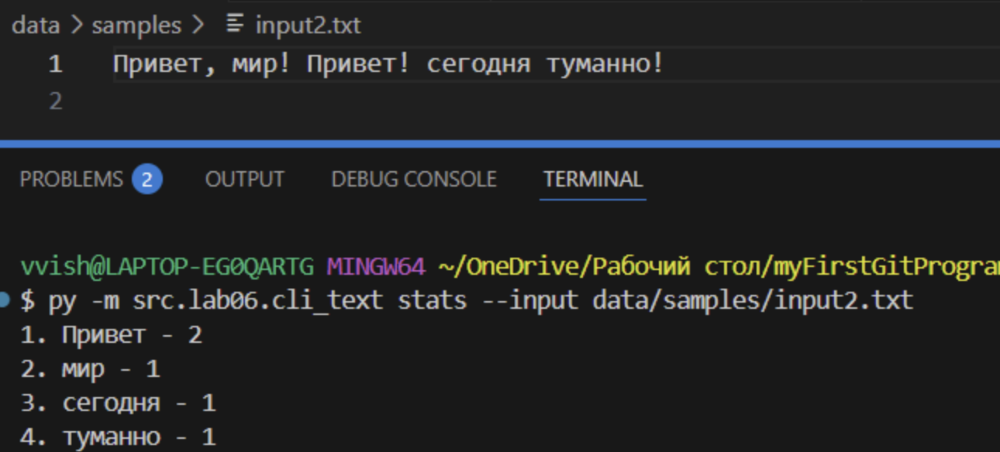

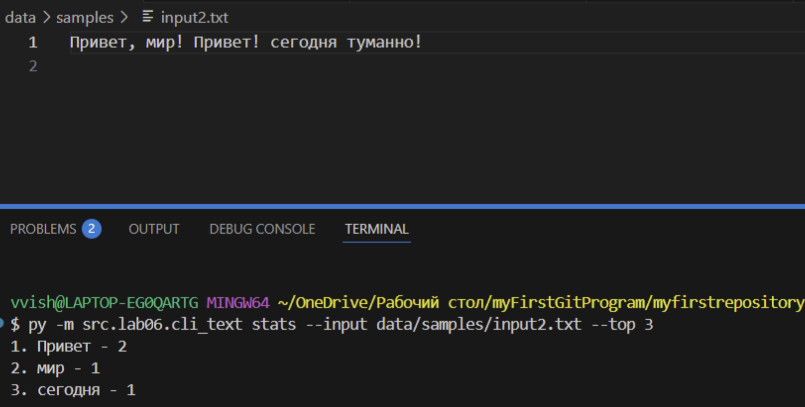
## Cli_convert
```
import argparse
from src.lib.json_csv import json_to_csv, csv_to_json
from src.lib.csv_xlsx import csv_to_xlsx

def main():
    parser = argparse.ArgumentParser(description="Конвертер данных между форматами")
    subparsers = parser.add_subparsers(dest="command", help="Доступные команды конвертации")

    json_to_csv_parser = subparsers.add_parser("json_to_csv", help="Конвертировать JSON в CSV")
    json_to_csv_parser.add_argument("--in", dest = "input", required= True, help="Входной JSON файл")
    json_to_csv_parser.add_argument("--out", dest = "output", required = True, help="Выходной CSV файл")


    csv_to_json_parser = subparsers.add_parser("csv_to_json", help="Конвертировать CSV в JSON")
    csv_to_json_parser.add_argument("--in", dest="input", required=True, help="Входной CSV файл")
    csv_to_json_parser.add_argument("--out", dest="output", required=True, help="Выходной JSON файл")

    csv_to_xlsx_parser = subparsers.add_parser("csv_to_xlsx", help="Конвертировать CSV в XLSX")
    csv_to_xlsx_parser.add_argument("--in", dest="input", required=True, help="Входной CSV файл")
    csv_to_xlsx_parser.add_argument("--out", dest="output", required=True, help="Выходной XLSX файл")

    args = parser.parse_args()

    if args.command == "json_to_csv":
        json_to_csv(json_path=args.input, csv_path=args.output)

    elif  args.command == "csv_to_json":
        csv_to_json(csv_path=args.input, json_path=args.output)

    elif args.command == "csv_to_xlsx":
        csv_to_xlsx(csv_path=args.input, xlsx_path=args.output)

if __name__ == "__main__":
    main()
```
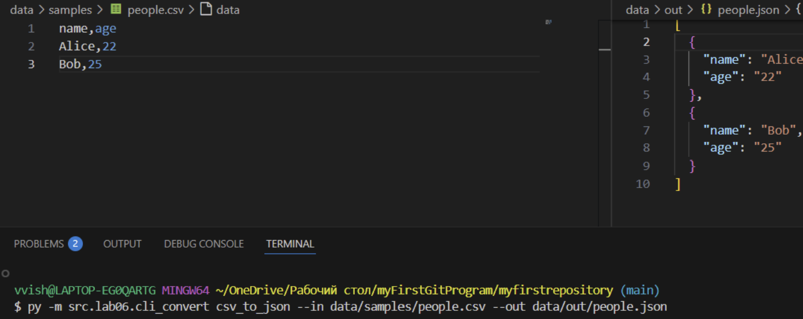
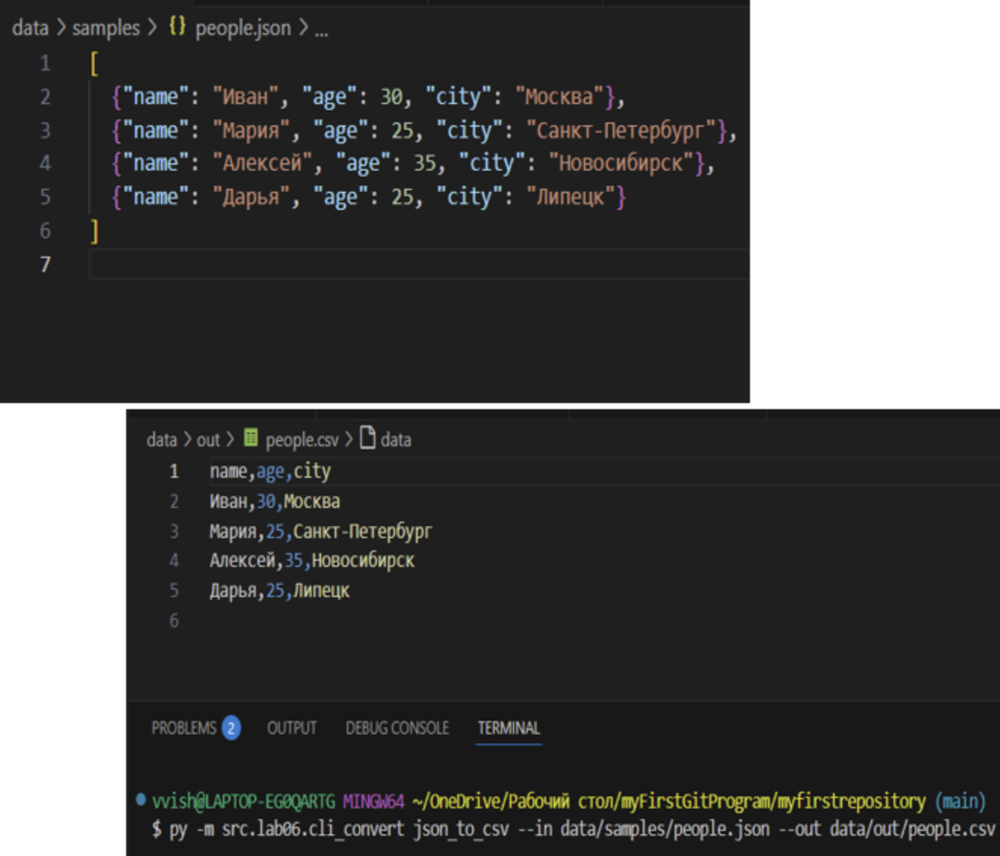
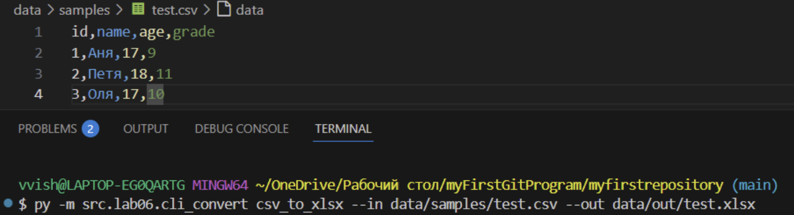
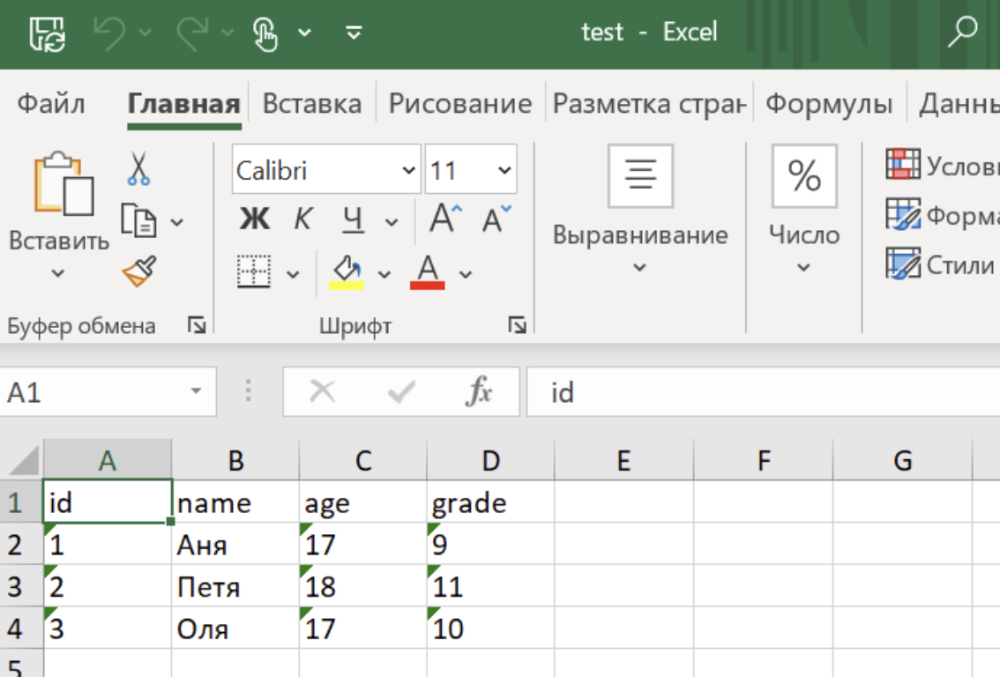

# **Лабораторная работа 7**
## Задание 1
```
import pytest
#import sys
#import os


#sys.path.insert(0, os.path.dirname(os.path.dirname(os.path.abspath(__file__))))

#from lib.text import normalize, tokenize, count_freq, top_n
from src.lab03.text import normalize, tokenize, count_freq, top_n


class TestText:

    @pytest.mark.parametrize(
        "input_text, expected",
        [
            ("Hello world", "hello world"),
            (" PYTHON  Programming  ", "python programming"),
            ("Test123", "test123"),
            ("", ""),
            ("  ", ""),
            ("Hello!!??", "hello!!??"),
            ("Привет Мир", "привет мир"),
            ("café", "café"),
        ],
    )
    def test_normalize(self, input_text, expected):
        assert normalize(input_text) == expected

    @pytest.mark.parametrize(
        "input_text, expected",
        [
            ("Hello world", ["Hello", "world"]),
            ("", []),
            ("hello, world!", ["hello", "world"]),
            ("Привет мир", ["Привет", "мир"]),
        ],
    )
    def test_tokenize(self, input_text, expected):
        assert tokenize(input_text) == expected

    @pytest.mark.parametrize(
        "tokens, expected",
        [
            (["hello", "world", "hello"], {"hello": 2, "world": 1}),
            ([], {}),
            (["a", "b", "a", "c", "c"], {"a": 2, "b": 1, "c": 2}),
        ],
    )
    def test_count_freq(self, tokens, expected):
        assert count_freq(tokens) == expected

    @pytest.mark.parametrize(
        "freq, n, expected",
        [
            ({"hello": 2, "world": 1}, 1, [("hello", 2)]),
            ({"a": 2, "b": 2, "c": 1}, 2, [("a", 2), ("b", 2)]),
            ({"x": 3, "y": 3, "z": 3}, 3, [("x", 3), ("y", 3), ("z", 3)]),
            ({}, 1, []),
        ],
    )
    def test_top_n(self, freq, n, expected):
        assert top_n(freq, n) == expected
```
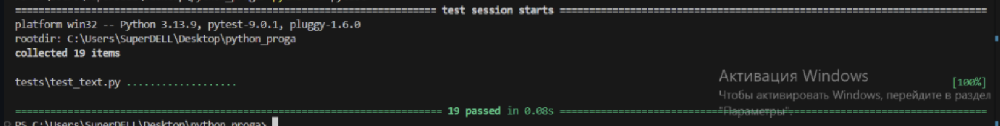
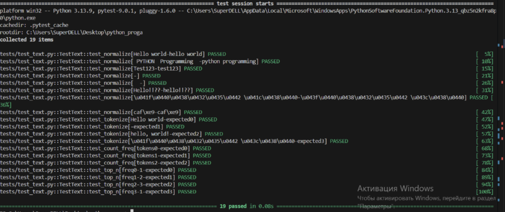
## Задание 2
```
import json
import csv
#import sys
#import os
from pathlib import Path
import pytest

#sys.path.insert(0, os.path.dirname(os.path.dirname(os.path.abspath(__file__))))
#from lib.json_csv import json_to_csv, csv_to_json

from src.lab05.json_csv import json_to_csv, csv_to_json

def test_json_to_csv_roundtrip(tmp_path: Path):
    src = tmp_path / "people.json"
    dst = tmp_path / "people.csv"
    data = [
        {"name": "Alice", "age": 22},
        {"name": "Bob", "age": 25},
    ]
    src.write_text(json.dumps(data, ensure_ascii=False, indent=2), encoding="utf-8")
    json_to_csv(str(src), str(dst))

    with dst.open(encoding="utf-8") as f:
        rows = list(csv.DictReader(f))

    assert len(rows) == len(data)
    assert {"name", "age"} <= set(rows[0].keys())


def test_csv_to_json_roundtrip(tmp_path: Path):
    src = tmp_path / "people.csv"
    dst = tmp_path / "people_out.json"
    rows = [
        {"name": "Alice", "age": "22"},
        {"name": "Bob", "age": "25"},
    ]
    with src.open("w", encoding="utf-8", newline="") as f:
        writer = csv.DictWriter(f, fieldnames=["name", "age"])
        writer.writeheader()
        writer.writerows(rows)

    csv_to_json(str(src), str(dst))

    data_out = json.loads(dst.read_text(encoding="utf-8"))

    assert len(data_out) == len(rows)
    assert all("name" in rec and "age" in rec for rec in data_out)


@pytest.mark.parametrize(
    "func, input_file, error",
    [
        ("json_to_csv", "invalid.json", ValueError),
        ("csv_to_json", "invalid.csv", ValueError),
    ],
)
def test_invalid_content_raises(func, input_file, error, tmp_path: Path):
    
    fpath = tmp_path / input_file
    fpath.write_text("this is not valid json or csv", encoding="utf-8")

    
    dst = tmp_path / "out.file"

    
    f = json_to_csv if func == "json_to_csv" else csv_to_json

    with pytest.raises(error):
        f(str(fpath), str(dst))


@pytest.mark.parametrize("func", [json_to_csv, csv_to_json])
def test_file_not_found_raises(func, tmp_path: Path):
    non_existent_path = tmp_path / "no_such_file.non"
    dst = tmp_path / "out.file"
    with pytest.raises(FileNotFoundError):
        func(str(non_existent_path), str(dst))
```
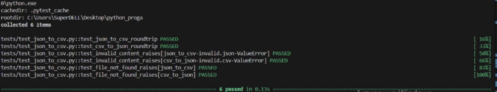
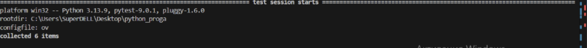
## Pytest
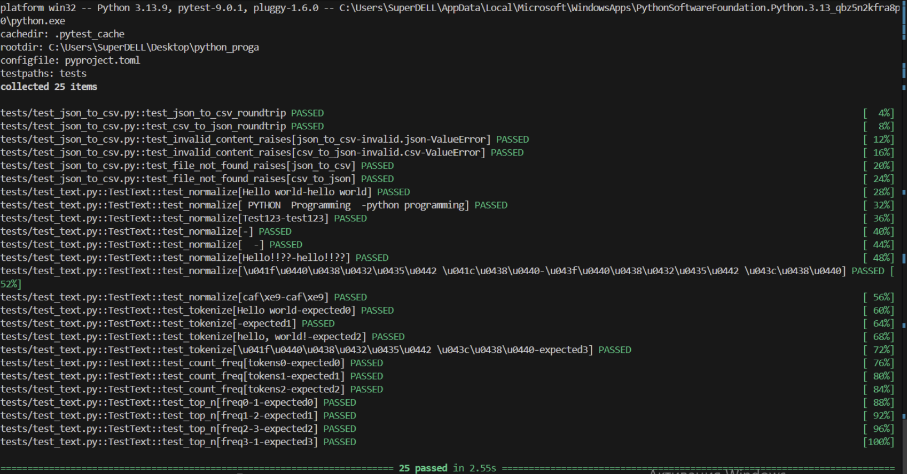
## Black
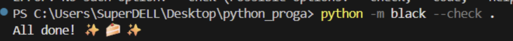
## Pytest -cov
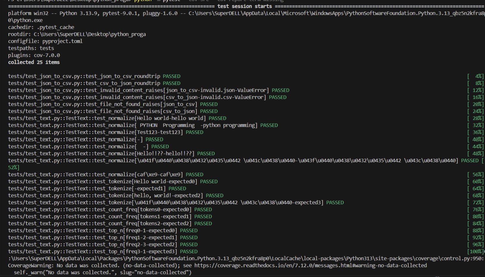
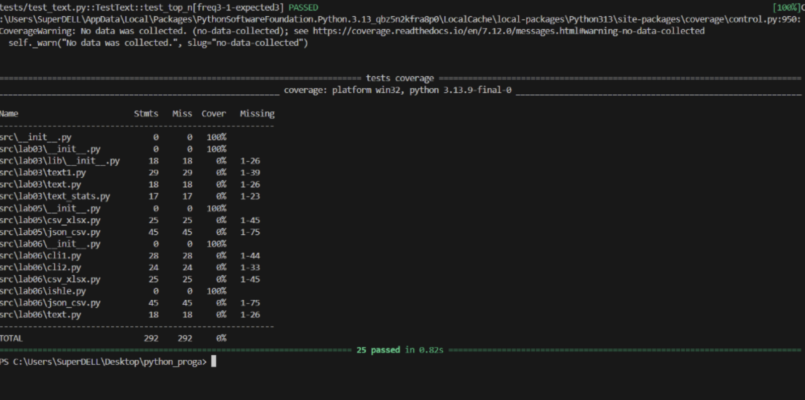

# **Лабораторная работа 8**
## Задание A
```

import pytest
from scr.lib.moduls import normalize, tokenize, count_freq, top_n


@pytest.mark.parametrize(
    "scr,expected",
    [
        ("ПрИвЕт\nМИр\t", "привет мир"),
        ("ёжик, Ёлка", "ежик, елка"),
        ("Hello\r\nWorld", "hello world"),
        ("  двойные   пробелы  ", "двойные пробелы"),
    ],
)
def test_normalize(scr, expected):
    assert normalize(scr) == expected


@pytest.mark.parametrize(
    "scr,expected",
    [
        ("привет мир", ["привет", "мир"]),
        ("hello,world!!!", ["hello", "world"]),
        ("по-настоящему круто", ["по-настоящему", "круто"]),
        ("2025 год", ["2025", "год"]),
        ("emoji 😀 не слово", ["emoji", "не", "слово"]),
    ],
)
def test_tokenize(scr, expected):
    assert tokenize(scr) == expected


@pytest.mark.parametrize(
    "tokens,expected", 
    [
    (["a", "b", "a", "a", "c", "b"], {"a": 3, "b": 2, "c": 1}),
    ([], {}),
    ],
)
def test_count_freq(tokens, expected):
    assert count_freq(tokens) == expected


@pytest.mark.parametrize(
    "freq,n,expected", 
    [
    ({"a": 3, "b": 1, "c": 2}, 2, [("a", 3), ("c", 2)]),
    ({"beta": 1, "alpha": 1, "gamma": 1}, 3, [("alpha", 1), ("beta", 1), ("gamma", 1)]),
    ({"one": 2, "two": 1}, 10, [("one", 2), ("two", 1)]),
    ({"a": 1, "b": 2}, 0, []),
    ],
)
def test_top_n(freq, n, expected):
    assert top_n(freq, n) == expected
```
## Задание B
```

import pytest
from pathlib import Path
import csv
import json
from scr.lib.json_csv import json_to_csv, csv_to_json

"""позитивчик"""

def test_csv_to_json_basic(tmp_path: Path):
    #Проверка корректной конвертации CSV → JSON
    scr = tmp_path / "people.csv"
    dst = tmp_path / "people.json"

    rows = [
        ["name", "age"],
        ["Alice", "22"],
        ["Bob", "25"],
    ]

    with scr.open("w", encoding="utf-8") as f:
        writer = csv.writer(f)
        writer.writerows(rows)

    csv_to_json(scr, dst)

    data = json.loads(dst.read_text(encoding="utf-8"))

    assert len(data) == 2
    assert data[1]["name"] == "Bob"
    assert set(data[0].keys()) == {"name", "age"}

def test_json_to_csv_basic(tmp_path: Path):
    #Проверка корректной конвертации JSON → CSV
    scr = tmp_path / "people.json"
    dst = tmp_path / "people.csv"

    data = [
        {"name": "Alice", "age": 22},
        {"name": "Bob", "age": 25},
    ]

    scr.write_text(json.dumps(data, ensure_ascii=False), encoding="utf-8")

    json_to_csv(scr, dst)

    with dst.open(encoding="utf-8") as f:
        reader = list(csv.DictReader(f))

    assert len(reader) == 2
    assert reader[0]["name"] == "Alice"
    assert set(reader[0].keys()) == {"name", "age"}

"""туда-сюда"""
def test_json_to_csv_roundtrip(tmp_path: Path):
    scr = tmp_path / "people.json"
    mid = tmp_path / "people.csv"
    dst = tmp_path / "people2.json"

    data = [
        {"name": "Alice", "age": 22},
        {"name": "Bob", "age": 25},
    ]

    scr.write_text(json.dumps(data, ensure_ascii=False), encoding="utf-8")

    json_to_csv(scr, mid)
    csv_to_json(mid, dst)

    data2 = json.loads(dst.read_text(encoding="utf-8"))

    assert data2 == [
        {"name": "Alice", "age": "22"},
        {"name": "Bob", "age": "25"},
    ]


def test_csv_to_json_roundtrip(tmp_path: Path):
    scr = tmp_path / "data.csv"
    mid = tmp_path / "data.json"
    dst = tmp_path / "data2.csv"

    rows = [
        ["city", "tsss"],
        ["Moscow", "677554335"],
        ["Paris", "5234521"],
    ]

    with scr.open("w", encoding="utf-8") as f:
        writer = csv.writer(f)
        writer.writerows(rows)

    csv_to_json(scr, mid)
    json_to_csv(mid, dst)

    with dst.open(encoding="utf-8") as f:
        result = list(csv.DictReader(f))

    assert len(result) == 2
    assert set(result[0].keys()) == {"city", "tsss"}

"""негативчик"""
def test_json_to_csv_empty_file(tmp_path: Path):
    # пустой JSON файл - ValueError
    scr = tmp_path / "bad.json"
    dst = tmp_path / "out.csv"
    scr.write_text("", encoding="utf-8")

    with pytest.raises(ValueError):
        json_to_csv(str(scr), str(dst))


def test_csv_to_json_empty_file(tmp_path: Path):
    # пустой CSV файл - ValueError
    scr = tmp_path / "bad.csv"
    dst = tmp_path / "out.json"
    scr.write_text("", encoding="utf-8")

    with pytest.raises(ValueError):
        csv_to_json(str(scr), str(dst))

def test_json_to_csv_missing_file(tmp_path: Path):
    # несуществующий JSON файл - FileNotFoundError
    scr = tmp_path / "no_file.json"
    dst = tmp_path / "out.csv"

    with pytest.raises(FileNotFoundError):
        json_to_csv(scr, dst)

def test_csv_to_json_missing_file(tmp_path: Path):
    # несуществующий CSV файл - FileNotFoundError
    scr = tmp_path / "no_file.csv"
    dst = tmp_path / "out.json"

    with pytest.raises(FileNotFoundError):
        csv_to_json(scr, dst)
```
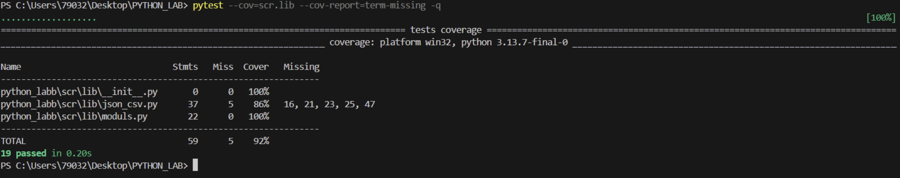
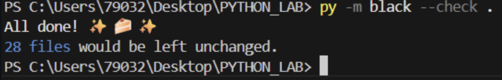

# **Лабораторная работа 9**
## Задание A
```
import csv
from pathlib import Path
from typing import List, Dict, Any
import sys
import os

sys.path.append(os.path.join(os.path.dirname(__file__), '../..'))
from models_copy import Student

class Group:
    def __init__(self, storage_path: str):
        self.path = Path("data/lab_9") / storage_path # Создаем полный путь к файлу в data/lab_9
        self._ensure_storage_exists()
    
    def _ensure_storage_exists(self):
        self.path.parent.mkdir(parents=True, exist_ok=True) # Создаем папку data/lab_9 если её нет
        
        if not self.path.exists():
            with open(self.path, 'w', encoding='utf-8', newline='') as f:
                writer = csv.DictWriter(f, fieldnames=['fio', 'birthdate', 'group', 'gpa'])
                writer.writeheader()
    
    def _read_all(self) -> List[Dict[str, Any]]: # Прочитать все строки из CSV
        rows = []
        with open(self.path, 'r', encoding='utf-8') as f:
            reader = csv.DictReader(f)
            for row in reader:
                row['gpa'] = float(row['gpa'])
                rows.append(row)
        return rows
    
    def _write_all(self, rows: List[Dict[str, Any]]): # Записать все строки в CSV
        with open(self.path, 'w', encoding='utf-8', newline='') as f:
            writer = csv.DictWriter(f, fieldnames=['fio', 'birthdate', 'group', 'gpa'])
            writer.writeheader()
            writer.writerows(rows)
    
    def list(self) -> List[Student]: # Вернуть всех студентов в виде списка Student
        rows = self._read_all()
        students = []
        for row in rows:
            try:
                student = Student.from_dict(row)
                students.append(student)
            except ValueError as e:
                print(f"Ошибка валидации студента {row['fio']}: {e}")
        return students
    
    def add(self, student: Student): # Добавить нового студента в CSV
        try:
            validated_student = Student(
                fio=student.fio,
                birthdate=student.birthdate,
                group=student.group,
                gpa=student.gpa
            )
        except ValueError as e:
            raise ValueError(f"Некорректные данные студента: {e}")
        
        with open(self.path, 'a', encoding='utf-8', newline='') as f:
            writer = csv.DictWriter(f, fieldnames=['fio', 'birthdate', 'group', 'gpa'])
            writer.writerow(validated_student.to_dict())
    
    def find(self, substr: str) -> List[Student]: # Найти студентов по подстроке в fio
        students = self.list()
        return [student for student in students if substr.lower() in student.fio.lower()]
    
    def remove(self, fio: str): # Удалить запись(и) с данным fio
        rows = self._read_all()
        updated_rows = [row for row in rows if row['fio'] != fio]
        
        if len(updated_rows) == len(rows):
            raise ValueError(f"Студент с ФИО '{fio}' не найден")
        
        self._write_all(updated_rows)
    
    def update(self, fio: str, **fields): # Обновить поля существующего студента
        rows = self._read_all()
        updated = False
        
        for row in rows:
            if row['fio'] == fio:
                for field, value in fields.items():
                    if field in ['fio', 'birthdate', 'group', 'gpa']:
                        row[field] = value
                updated = True
                try:
                    Student.from_dict(row)
                except ValueError as e:
                    raise ValueError(f"Некорректные данные после обновления: {e}")
        
        if not updated:
            raise ValueError(f"Студент с ФИО '{fio}' не найден")
        
        self._write_all(rows)
    
    def stats(self) -> Dict[str, Any]: # Статистика по группе
        students = self.list()
        
        if not students:
            return {
                "count": 0,
                "min_gpa": 0,
                "max_gpa": 0,
                "avg_gpa": 0,
                "groups": {},
                "top_5_students": []
            }
        
        gpas = [student.gpa for student in students]
        groups_stats = {}
        for student in students:
            groups_stats[student.group] = groups_stats.get(student.group, 0) + 1
        
        sorted_students = sorted(students, key=lambda s: s.gpa, reverse=True)
        top_5 = [{"fio": s.fio, "gpa": s.gpa} for s in sorted_students[:5]]
        
        return {
            "count": len(students),
            "min_gpa": min(gpas),
            "max_gpa": max(gpas),
            "avg_gpa": round(sum(gpas) / len(gpas), 2),
            "groups": groups_stats,
            "top_5_students": top_5
        }
    
    def exists(self, fio: str) -> bool: # Проверить существует ли студент с таким ФИО
        students = self.list()
        return any(student.fio == fio for student in students)

    def is_empty(self) -> bool: # Проверить пуст ли файл (только заголовок)
        with open(self.path, 'r', encoding='utf-8') as f:
            reader = csv.DictReader(f)
            return len(list(reader)) == 0
    
if __name__ == "__main__":

    group = Group("students.csv") # Создаем группу

    if group.is_empty(): # Добавляем студентов
        students_to_add = [
            Student("Иванов Иван", "2000-05-15", "БИВТ-21-1", 4.5),
            Student("Петрова Анна", "2001-12-03", "БИВТ-21-2", 3.8),
            Student("Сидоров Алексей", "1999-08-22", "БИВТ-21-1", 4.2),
            Student("Козлова Мария", "2002-03-10", "БИВТ-21-3", 4.8),
            Student("Новиков Дмитрий", "2000-11-25", "БИВТ-21-2", 3.5),
            Student("Иванова Ольга", "2001-07-14", "БИВТ-21-1", 4.9)
        ]
        
        for student in students_to_add:
            group.add(student)
            print(f"    Добавлен: {student.fio}")
    else:
        print("Файл уже содержит данные")
    
    # Тестируем методы
    print("Все студенты:")
    for student in group.list():
        print(f"  {student}")
    
    print("\nПоиск по 'Иванов':")
    for student in group.find("Иванов"):
        print(f"  {student}")
    
    print("\nСтатистика:")
    stats = group.stats()
    for key, value in stats.items():
        if key == "top_5_students":
            print(f"  {key}:")
            for student in value:
                print(f"    {student['fio']} - GPA: {student['gpa']}")
        else:
            print(f"  {key}: {value}")
```
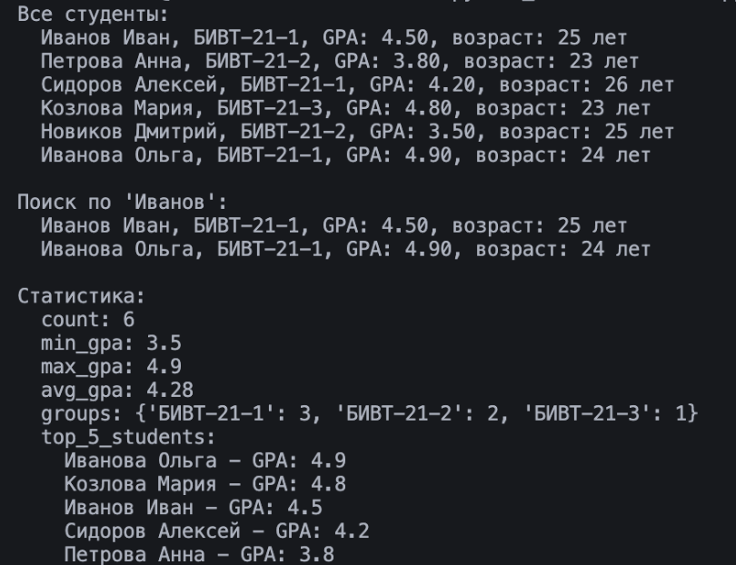
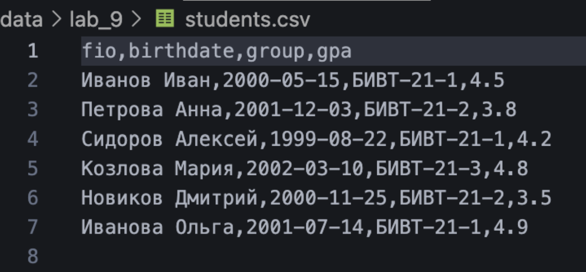
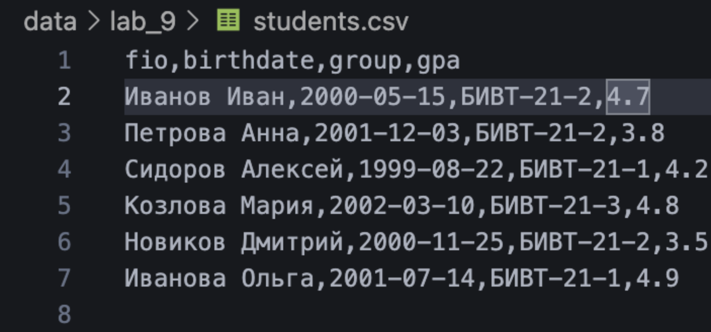
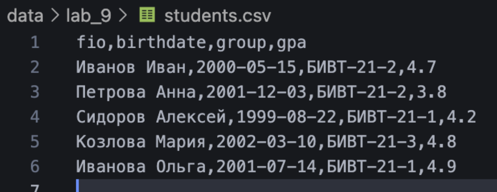
# **Лабораторная работа 10**
## Теория
# Стек (англ. stack - «стопка») - абстрактный тип данных, упорядоченный набор элементов. Добавление новых элементов и удаление существующих происходит с одного конца, называемого вершиной стека.

Операции:

push(x) — положить элемент сверху;
pop() — снять верхний элемент;
peek() — посмотреть верхний, не снимая.
Типичные применения:

история действий (undo/redo);
обход графа/дерева в глубину (DFS);
парсинг выражений, проверка скобок.
Очередь (Queue) — это структура данных, которая работает по принципу FIFO (First In, First Out): «первый пришёл — первый вышел». Элементы добавляются в конец очереди и извлекаются из начала.

Операции:

enqueue(x) — добавить в конец;
dequeue() — взять элемент из начала;
peek() — посмотреть первый элемент, не удаляя.
Типичные применения:

обработка задач по очереди (job queue);
обход графа/дерева в ширину (BFS);
буферы (сетевые, файловые, очереди сообщений).
В Python:

обычный list плохо подходит для реализации очереди:
удаление с начала pop(0) — это O(n) (все элементы сдвигаются);
collections.deque даёт O(1) операции по краям:
append / appendleft — O(1);
pop / popleft — O(1).
Односвязный список (Singly Linked List) — это линейная и однонаправленная структура данных, в которой данные сохраняются на узлах, и каждый узел связан ссылкой со своим следующим узлом.

Структура:

состоит из узлов Node;
каждый узел хранит:
value — значение элемента;
next — ссылку на следующий узел или None (если это последний).
Основные идеи:

элементы не хранятся подряд в памяти, как в массиве;
каждый элемент знает только «следующего соседа».
Плюсы:

вставка/удаление в начало списка за O(1):
если есть ссылка на голову (head), достаточно перенаправить одну ссылку;
при удалении из середины не нужно сдвигать остальные элементы:
достаточно обновить ссылки узлов;
удобно использовать как базовый строительный блок для других структур (например, для очередей, стеков, хеш-таблиц с цепочками).
Минусы:

доступ по индексу i — O(n):
чтобы добраться до позиции i, нужно пройти i шагов от головы;
нет быстрого доступа к предыдущему элементу:
чтобы удалить узел, нужно знать его предыдущий узел → часто нужен дополнительный проход.
Двусвязный список (Doubly Linked List) — это структура данных, в которой каждый элемент (узел) содержит указатели на предыдущий и следующий элементы списка.

Основные идеи:

можно двигаться как вперёд, так и назад по цепочке узлов;
удобно хранить ссылки на оба конца: head и tail.
Плюсы по сравнению с односвязным:

удаление узла по ссылке на него — O(1):
достаточно «вытащить» его, перенастроив prev.next и next.prev;
не нужно искать предыдущий узел линейным проходом;
эффективен для структур, где часто нужно удалять/добавлять элементы в середине, имея на них прямые ссылки (например, реализация LRU-кэша);
можно легко идти в обе стороны:
прямой и обратный обход списка.
Минусы:

узел занимает больше памяти:
нужно хранить две ссылки (prev, next);
код более сложный:
легко забыть обновить одну из ссылок и «сломать» структуру;
сложнее отлаживать.
## Практика
## Задание A
```
from collections import deque
from typing import Any, Optional

class Stack: # Структура данных 'Стек' (LIFO - Last In First Out)
    def __init__(self): # Инициализация пустого стека
        self._data = []
    
    def push(self, item: Any) -> None: # Добавить элемент на вершину стека
        self._data.append(item) # item: Элемент для добавления
    
    def pop(self) -> Any: # Снять верхний элемент стека и вернуть его
        if self.is_empty(): # IndexError: Если стек пуст
            raise IndexError("Невозможно извлечь элемент: стек пуст")
        return self._data.pop()
    
    def peek(self) -> Optional[Any]: # Вернуть верхний элемент без удаления
        if self.is_empty():
            return None # Верхний элемент стека или None если стек пуст
        return self._data[-1]
    
    def is_empty(self) -> bool: # Проверить пуст ли стек
        return len(self._data) == 0 # True если стек пуст, иначе False
    
    def __len__(self) -> int: # Количество элементов в стеке
        return len(self._data) # Количество элементов
    
    def __str__(self) -> str: # Строковое представление стека
        return f"Stack({self._data})"
    
    def __repr__(self) -> str:
        return str(self)

class Queue: # Структура данных 'Очередь' (FIFO - First In First Out)    
    def __init__(self): # Инициализация пустой очереди
        self._data = deque()
    
    def enqueue(self, item: Any) -> None: # Добавить элемент в конец очереди
        self._data.append(item) # item: Элемент для добавления
    
    def dequeue(self) -> Any: # Взять элемент из начала очереди
        if self.is_empty():
            raise IndexError("Невозможно извлечь элемент: очередь пуста") # IndexError: Если очередь пуста
        return self._data.popleft()
    
    def peek(self) -> Optional[Any]: # Вернуть первый элемент без удаления
        if self.is_empty():
            return None # Первый элемент очереди или None если очередь пуста
        return self._data[0]
    
    def is_empty(self) -> bool: # Проверить пуста ли очередь
        return len(self._data) == 0 # True если очередь пуста, иначе False
    
    def __len__(self) -> int: # Количество элементов в очереди
        return len(self._data) # Количество элементов
    
    def __str__(self) -> str: # Строковое представление очереди
        return f"Queue({list(self._data)})"
    
    def __repr__(self) -> str:
        return str(self)
```
## Задание B
```
from typing import Any, Optional, Iterator

class Node: # Узел односвязного списка
    def __init__(self, value: Any, next_node: Optional['Node'] = None): # Инициализация узла
        self.value = value # value: Значение узла
        self.next = next_node # next_node: Ссылка на следующий узел
    
    def __str__(self) -> str: # Строковое представление узла
        return f"[{self.value}]"
    
    def __repr__(self) -> str:
        return str(self)

class SinglyLinkedList: # Односвязный список
    def __init__(self): # Инициализация пустого списка
        self.head = None
        self.tail = None # Для ускорения операций с концом списка
        self._size = 0
    
    def append(self, value: Any) -> None: # Добавить элемент в конец списка
        new_node = Node(value) # value: Значение для добавления
        
        if self.head is None: # Если список пуст
            self.head = new_node
            self.tail = new_node
        else: # Если в списке уже есть элементы
            self.tail.next = new_node
            self.tail = new_node
        
        self._size += 1
    
    def prepend(self, value: Any) -> None: # Добавить элемент в начало списка
        new_node = Node(value, self.head) # value: Значение для добавления
        self.head = new_node
        
        if self.tail is None: # Если список был пуст
            self.tail = new_node
        
        self._size += 1
    
    def insert(self, idx: int, value: Any) -> None: # Вставить элемент по указанному индексу
                                                    # idx: Индекс для вставки (0 <= idx <= len(list))
                                                    # value: Значение для вставки
        if idx < 0 or idx > self._size:
            raise IndexError(f"Индекс {idx} вне диапазона [0, {self._size}]") # IndexError: Если индекс вне допустимого диапазона
        
        if idx == 0:
            self.prepend(value)
            return
        
        if idx == self._size:
            self.append(value)
            return
        
        # Вставка в середину списка
        current = self.head
        for _ in range(idx - 1):
            current = current.next
        
        new_node = Node(value, current.next)
        current.next = new_node
        self._size += 1
    
    def remove(self, value: Any) -> bool: # Удалить первое вхождение значения
                                          # value: Значение для удаления
        if self.head is None: # True если элемент был найден и удален, иначе False
            return False
        
        # Если нужно удалить первый элемент
        if self.head.value == value:
            self.head = self.head.next
            if self.head is None:  # Если список стал пустым
                self.tail = None
            self._size -= 1
            return True
        
        # Поиск элемента для удаления
        current = self.head
        while current.next is not None and current.next.value != value:
            current = current.next
        
        if current.next is None: # Элемент не найден
            return False
        
        # Удаление найденного элемента
        if current.next == self.tail: # Если удаляем последний элемент
            self.tail = current
        
        current.next = current.next.next
        self._size -= 1
        return True
    
    def remove_at(self, idx: int) -> Any: # Удалить элемент по индексу
                                          # idx: Индекс элемента для удаления
        if idx < 0 or idx >= self._size:
            raise IndexError(f"Индекс {idx} вне диапазона [0, {self._size})") # IndexError: Если индекс вне допустимого диапазона
        
        if idx == 0: # Удаление первого элемента
            value = self.head.value
            self.head = self.head.next
            if self.head is None:
                self.tail = None
            self._size -= 1
            return value
        
        # Удаление из середины или конца
        current = self.head
        for _ in range(idx - 1):
            current = current.next
        
        value = current.next.value
        
        if current.next == self.tail: # Если удаляем последний элемент
            self.tail = current
        
        current.next = current.next.next
        self._size -= 1
        return value
    
    def get(self, idx: int) -> Any: # Получить элемент по индексу
                                    # idx: Индекс элемента
        if idx < 0 or idx >= self._size:
            raise IndexError(f"Индекс {idx} вне диапазона [0, {self._size})") # IndexError: Если индекс вне допустимого диапазона
        
        current = self.head
        for _ in range(idx):
            current = current.next
        
        return current.value
    
    def __iter__(self) -> Iterator[Any]: # Итератор по значениям списка
                                         # Значения списка в порядке от головы к хвосту
        current = self.head
        while current is not None:
            yield current.value
            current = current.next
    
    def __len__(self) -> int: # Количество элементов в списке
        return self._size
    
    def __str__(self) -> str: # Красивое строковое представление списка
        if self.head is None:
            return "None"
        
        parts = []
        current = self.head
        while current is not None:
            parts.append(str(current))
            current = current.next

        return " -> ".join(parts) + " -> None"
    
    def __repr__(self) -> str: # Формальное строковое представление списка
        values = list(self)
        return f"SinglyLinkedList({values})"
    
    def is_empty(self) -> bool: # Проверить пуст ли список
        return self._size == 0 # True если список пуст, иначе False
    
if __name__ == "__main__":
   # Пример использования
   lst = SinglyLinkedList()
   lst.append(1)
   lst.append(2)
   lst.prepend(0)
   lst.insert(2, 1.5)
   lst.remove_at(3)
   print(lst)
```
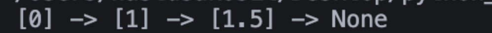
