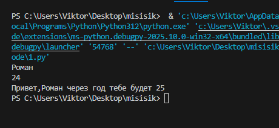
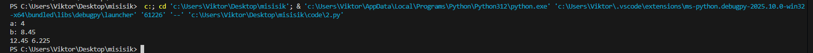
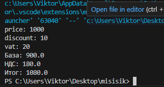
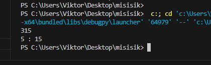
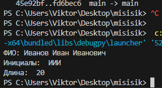

# **Лабораторная работа 1**
## Задание 1
```
name=input()
age=int(input())
print("Привет,"+name+" через год тебе будет "+(str((age+1))))
```
 
## Задание 2
```
a=input("a: ").replace(",",".")
b=input("b: ").replace(",",".")
a=float(a)
b=float(b)
s=a+b
avg=s/2
print(s,avg)
```

## Задание 3
```
price=float(input("price: "))
discount=float(input("discount: "))
vat=float(input("vat: "))
baza=price*(1-discount/100)
nds=baza*(vat/100)
itog=baza+nds
print("База: "+(str(baza)))
print("НДС: "+(str(nds)))
print("Итог: "+(str(itog)))
```

## Задание 4
```
m=int(input())
ch=m//60
mm=m%60
print(f"{ch}:{(mm-60*ch):02d}")
```

## Задание 5
```
name=input("ФИО: ").strip()
part=name.split()
length=len(''.join(part))+2
ini=''.join([i[0].upper() for i in part])
print(f"Инициалы: {ini}")
print(f"Длина (символов): {length}")
```

