# **Лабораторная работа 1**
## Задание 1
```
name=input()
age=int(input())
print("Привет,"+name+" через год тебе будет "+(str((age+1))))
```
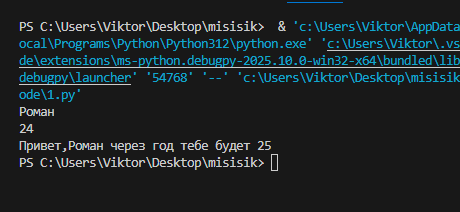 
## Задание 2
```
a=input("a: ").replace(",",".")
b=input("b: ").replace(",",".")
a=float(a)
b=float(b)
s=a+b
avg=s/2
print(s,avg)
```
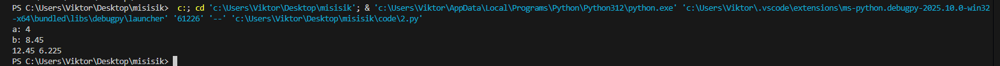
## Задание 3
```
price=float(input("price: "))
discount=float(input("discount: "))
vat=float(input("vat: "))
baza=price*(1-discount/100)
nds=baza*(vat/100)
itog=baza+nds
print("База: "+(str(baza)))
print("НДС: "+(str(nds)))
print("Итог: "+(str(itog)))
```
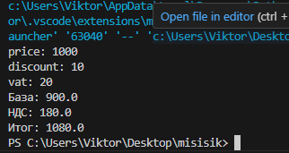
## Задание 4
```
m=int(input())
ch=m//60
mm=m%60
print(f"{ch}:{(mm-60*ch):02d}")
```
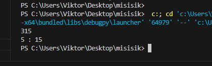
## Задание 5
```
name=input("ФИО: ").strip()
part=name.split()
length=len(''.join(part))+2
ini=''.join([i[0].upper() for i in part])
print(f"Инициалы: {ini}")
print(f"Длина (символов): {length}")
```
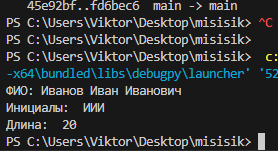

# **Лабораторная работа 2**
## Задание 1
```
a = [3, -1, 5, 5, 0]
b = [3, 1, 2, 1, 3]
c = [[1, 2], [3, 4]]
mat2 = []
def min_max(nums: list[float | int]) -> tuple[float | int, float | int]:
    if not nums:
        return ValueError
    return (min(nums), max(nums))

def unique_sorted(nums: list[float | int]) -> tuple[float | int, float | int]:
    if not nums:
        return ValueError
    return (sorted(set(nums)))

def flatten(mat: list[list | tuple]) -> list:
    if not nums:
        return ValueError
    for el in mat:
        mat2.extend(el)
    return(mat2)

```
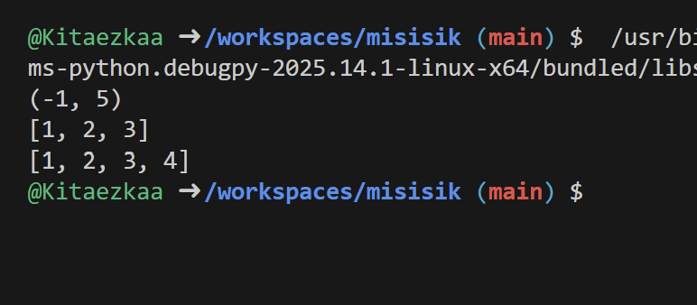
## Задание 2 (1b)
```
def transpose(mat: list[list[float | int]]) -> list[list]:
    if not mat:
        return []
    row_length = len(mat[0])
    for i, row in enumerate(mat):
        if len(row) != row_length:
            return ValueError
    result = []
    for cl in range(len(mat[0])):
        new_row = []
        for row in range(len(mat)):
            new_row.append(mat[row][cl])
        result.append(new_row)
    return result
print(transpose([[1, 2, 3]]))
print(transpose([[1], [2], [3]]))
print(transpose([[1, 2], [3, 4]]))
print(transpose([]))
print(transpose([[1, 2], [3]]))

def row_sums(mat: list[list[float | int]]) -> list[float]:
    if not mat:
        return []
    row_length = len(mat[0])
    for i, row in enumerate(mat):
        if len(row) != row_length:
            return ValueError
    result = []
    for row in mat:
        result.append(sum(row))
    return result
print(row_sums([[1, 2, 3], [4, 5, 6]]))
print(row_sums([[-1, 1], [10, -10]]))
print(row_sums([[0, 0], [0, 0]]))
print(row_sums([[1, 2], [3]]))

def col_sums(mat: list[list[float | int]]) -> list[float]:
    if not mat:
        return []
    row_length = len(mat[0])
    for i, row in enumerate(mat):
        if len(row) != row_length:
            return ValueError
    result = []
    for col in range(len(mat[0])):
        col_sum = 0
        for row in range(len(mat)):
            col_sum += mat[row][col]
        result.append(col_sum)
    return result
print(col_sums([[1, 2, 3], [4, 5, 6]]))
print(col_sums([[-1, 1], [10, -10]]))
print(col_sums([[0, 0], [0, 0]]))
print(col_sums([[1, 2], [3]]))
```
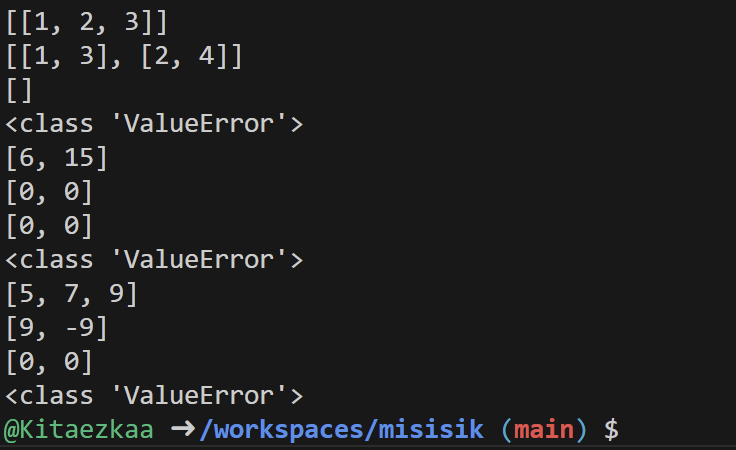
## Задание 3
```
from typing import Tuple

StudentRecord = Tuple[str, str, float]

def format_record(rec: StudentRecord) -> str:
    if len(rec) != 3:
        raise ValueError
    fio, group, gpa = rec
    if not isinstance(gpa, (int, float)):
        raise ValueError
    if gpa < 0 or gpa > 5:
        raise ValueError
    fio_parts = [part.strip() for part in fio.split()]
    if len(fio_parts) < 2:
        raise ValueError
    formatted_surname = fio_parts[0].capitalize()
    initials = ''.join([f'{name[0].upper()}.' for name in fio_parts[1:]])
    formatted_gpa = f'{gpa:.2f}'
    formatted_record = f"{formatted_surname} {initials}, гр. {group}, GPA {formatted_gpa}"
    return formatted_record
```
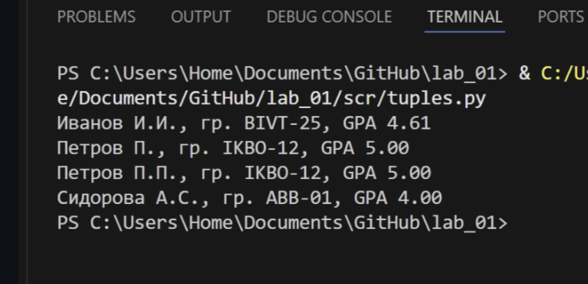

# **Лабораторная работа 3**
## Задание A (normalize)
```
def normalize(text: str, *, casefold: bool = True, yo2e: bool = True) -> str:
    text = text.casefold()
    if yo2e:
        text = text.replace('ё', 'е').replace('Ё', 'Е')
    text = text.replace('\t', ' ').replace('\r', ' ').replace('\n', ' ')
    text = ' '.join(text.split())
    text = text.strip()
    return text
print(normalize("ПрИвЕт\nМИр\t")) 
print(normalize("ёжик, Ёлка"))
print(normalize("Hello\r\nWorld"))
print(normalize("  двойные   пробелы  "))
```
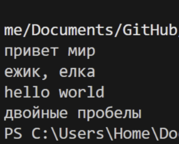
## Задание А (tokenize)
```
import re 
def tokenize(text: str) -> list[str]:
    return re.findall(r'\w+(?:-\w+)*', text)
print(tokenize("привет мир"))
print(tokenize("hello,world!!!"))
print(tokenize("по-настоящему круто"))
print(tokenize("2025 год"))
print(tokenize("emoji 😀 не слово"))
```
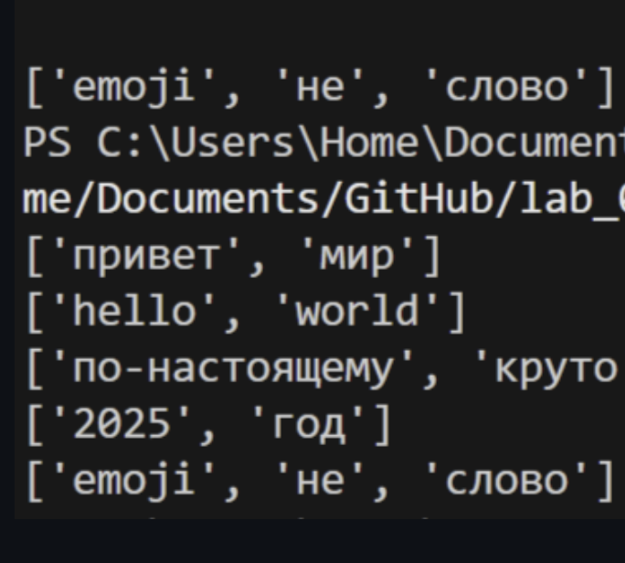
## Задание А (count_freq + top_n)
```
def count_freq(tokens: list[str]) -> dict[str, int]:
    c = {}  
    for w in tokens:
        cu = c.get(w, 0)
        c[w] = cu + 1
    return c
def top_n(freq: dict[str, int], n: int = 5) -> list[tuple[str, int]]:
    t = []
    for w, count in freq.items():
        t.append((-count, w))
    t.sort()
    result = []
    for neg_count, w in t:
        result.append((w, -neg_count))
    return result[:n]
tok = ["a", "b", "a", "c", "b", "a"]
freq = count_freq(tok)
print(top_n(freq, n=2))
tok_2 = ["bb", "aa", "bb", "aa", "cc"]
freq_2 = count_freq(tok_2)
print(top_n(freq_2, n=2))
```

## Задание B
```
from lib.text import normalize, tokenize, count_freq, top_n
import sys
def main():
    text = sys.stdin.buffer.read().decode('utf-8') #вход к бинарным данным,преобразует строку в юникод
    if not text.strip():
        print("Нет входных данных")
        return
    normalized_text = normalize(text)
    tokens = tokenize(normalized_text)
    

    if not tokens:
        print("В тексте не найдено слов")
        return

    total_words = len(tokens) # общее количество слов
    freq_dict = count_freq(tokens) # словарь частот
    unique_words = len(freq_dict) # количеситво уникальных слов 
    top_words = top_n(freq_dict, 5) # самые популярные частоты
    
    print(f"Всего слов: {total_words}")
    print(f"Уникальных слов: {unique_words}")
    print("Топ-5:")
    for word, count in top_words:
        print(f"{word}: {count}")


if __name__ == "__main__":  
    main()
```
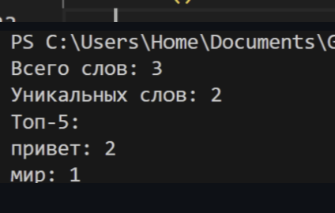

# **Лабораторная работа 4**
## Задание A
```
import csv
from pathlib import Path
from typing import Iterable, Sequence

def read_text(path: str | Path, encoding: str = "utf-8") -> str:
    try:
        return Path(path).read_text(encoding=encoding)
    except FileNotFoundError:
        return "Такого файла нету"
    except UnicodeDecodeError:
        return "Неудалось изменить кодировку"

def write_csv(rows: list[tuple | list], path: str | Path, header: tuple[str, ...] | None = None) -> None:
    p = Path(path)
    with p.open('w', newline="", encoding="utf-8") as file: # контроль переноса строк,кодироввка файла
        f = csv.writer(file)
        if header is None and rows == []: # нет заголовка и данных
            file_c.writerow(('a', 'b')) 
        if header is not None:
            f.writerow(header)
        if rows != []:
            const = len(rows[0])
            for i in rows:
                if len(i) != const:
                    return ValueError
        f.writerows(rows)

def ensure_parent_dir(path: str | Path) -> None:
    Path(path).parent.mkdir(parents=True, exist_ok=True)

print(read_text(r"C:\Users\Home\Documents\GitHub\lab_01\data\input.txt"))
write_csv([("word","count"),("test",3)], r"C:\Users\Home\Documents\GitHub\lab_01\data\check.csv")
```
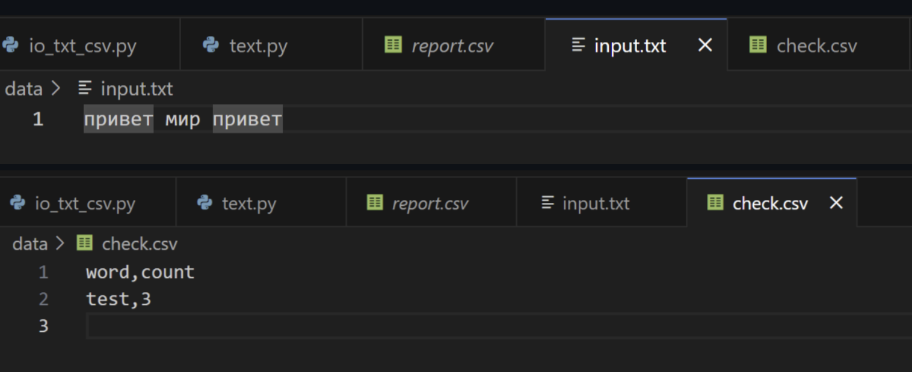
## Задание B
```
from io_txt_csv import read_text, write_csv, ensure_parent_dir
import sys
from pathlib import Path

sys.path.append(r'C:\Users\Home\Documents\GitHub\lab_01\lib')

from text import normalize, tokenize, count_freq, top_n


def exist_path(path_f: str):
    return Path(path_f).exists() #существует ли файл 


def main(file: str, encoding: str = 'utf-8'): 
    if not exist_path(file):
        raise FileNotFoundError 
    
    file_path = Path(file)
    text = read_text(file, encoding=encoding) # текст в одну строку
    norm = normalize(text) 
    tokens = tokenize(norm)
    freq_dict = count_freq(tokens)
    top = top_n(freq_dict, 5)
    top_sort = sorted(top, key=lambda x: (x[1], x[0]), reverse=True) # сортирует список, критерии сортировки, частота слово и само слово, сортировка по убыванию
    report_path = file_path.parent / 'report.csv' # cоздает путь для файла отчета в той же папке, где исходный файл
    write_csv(top_sort, report_path, header=('word', 'count'))
    
    print(f'Всего слов: {len(tokens)}')
    print(f'Уникальных слов: {len(freq_dict)}')
    print('Топ-5:')
    for cursor in top_sort:
        print(f'{cursor[0]}: {cursor[-1]}')


main(r'C:\Users\Home\Documents\GitHub\lab_01\data\input.txt')
```
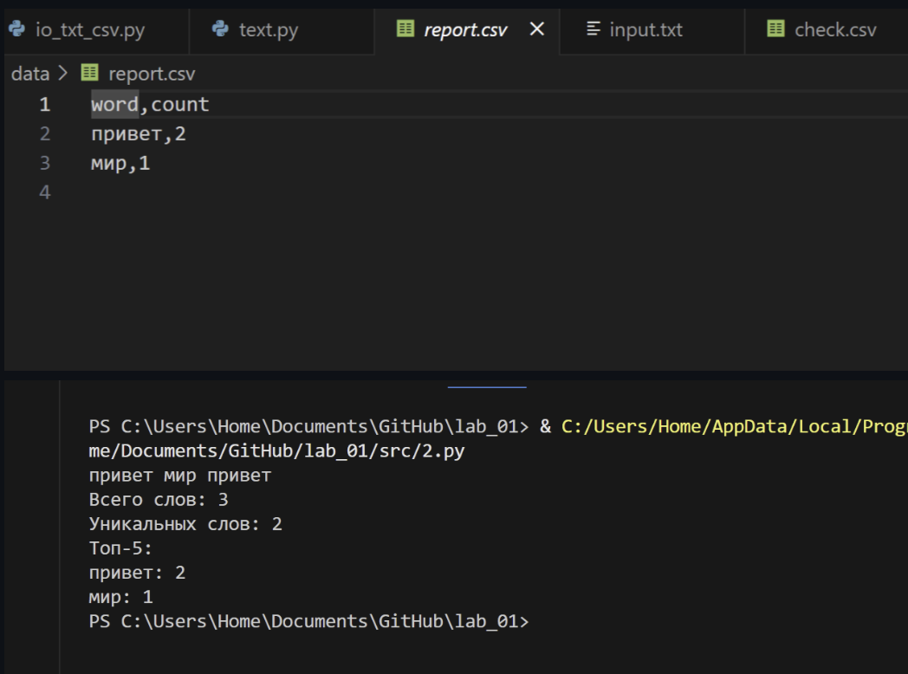
# **Лабораторная работа 5**
## Задание A
```
def json_to_csv(json_path: str, csv_path: str) -> None:

    json_file = Path(json_path)
    csv_file = Path(csv_path)
    
    if not json_file.exists():
        raise FileNotFoundError(f"Файл {json_path} не найден")
    
    if json_file.suffix.lower() != '.json':
        raise ValueError("Неверный тип файла. Ожидается .json")
    
    try:
        with json_file.open('r', encoding='utf-8') as f:
            data = json.load(f)
    except json.JSONDecodeError as e:
        raise ValueError(f"Ошибка чтения JSON: {e}")
    
    if not data:
        raise ValueError("Пустой JSON или неподдерживаемая структура")
    
    if not isinstance(data, list):
        raise ValueError("JSON должен содержать список объектов")
    
    if not all(isinstance(item, dict) for item in data):
        raise ValueError("Все элементы JSON должны быть словарями")
    
    all_keys = set()
    for item in data:
        all_keys.update(item.keys())

    if data:
        first_item_keys = list(data[0].keys())
        remaining_keys = sorted(all_keys - set(first_item_keys))
        fieldnames = first_item_keys + remaining_keys
    else:
        fieldnames = sorted(all_keys)
    # Запись в CSV
    try:
        with csv_file.open('w', newline='', encoding='utf-8') as f:
            writer = csv.DictWriter(f, fieldnames=fieldnames)
            writer.writeheader()
            for row in data:
                complete_row = {key: row.get(key, '') for key in fieldnames}
                writer.writerow(complete_row)
    except Exception as e:
        raise ValueError(f"Ошибка записи CSV: {e}")

def csv_to_json(csv_path: str, json_path: str) -> None:
  
    csv_file = Path(csv_path)
    json_file = Path(json_path)
    
    if not csv_file.exists():
        raise FileNotFoundError(f"Файл {csv_path} не найден")

    if csv_file.suffix.lower() != '.csv':
        raise ValueError("Неверный тип файла. Ожидается .csv")
    
    try:
        with csv_file.open('r', encoding='utf-8') as f:
            reader = csv.DictReader(f)
            if reader.fieldnames is None:
                raise ValueError("CSV файл не содержит заголовка")
            
            data = list(reader)
            
    except Exception as e:
        raise ValueError(f"Ошибка чтения CSV: {e}")

    if not data:
        raise ValueError("Пустой CSV файл")

    try:
        with json_file.open('w', encoding='utf-8') as f:
            json.dump(data, f, ensure_ascii=False, indent=2)
    except Exception as e:
        raise ValueError(f"Ошибка записи JSON: {e}")

json_to_csv('scr/data/samples/people.json', 'scr/data/out/people_from_json.csv')
csv_to_json('scr/data/samples/people.csv', 'scr/data/out/people_from_csv.json')
```
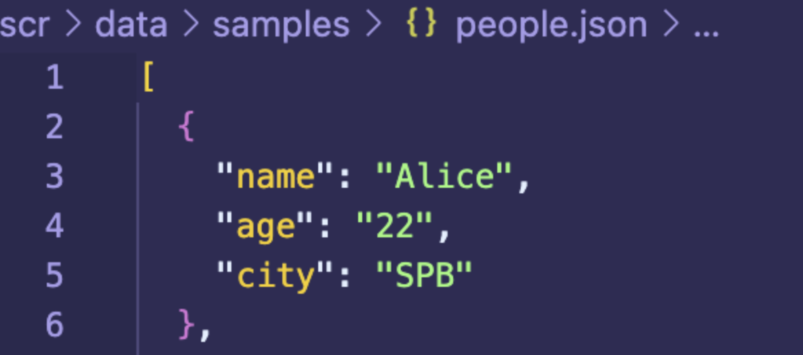
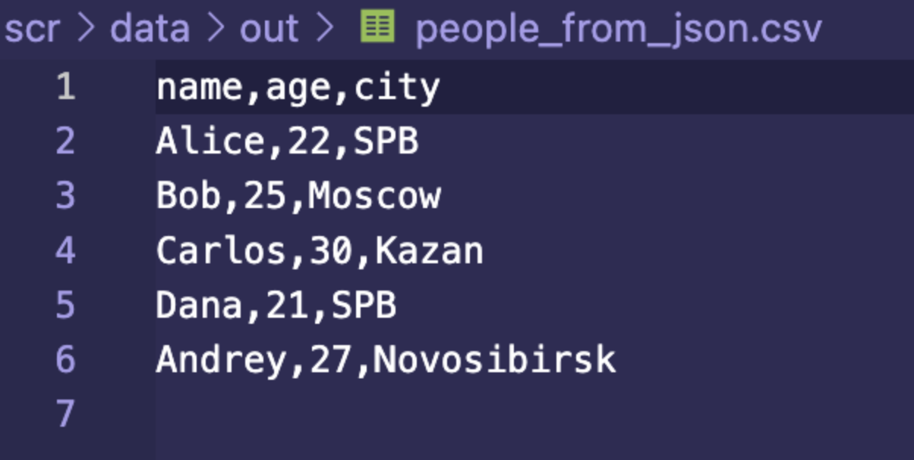
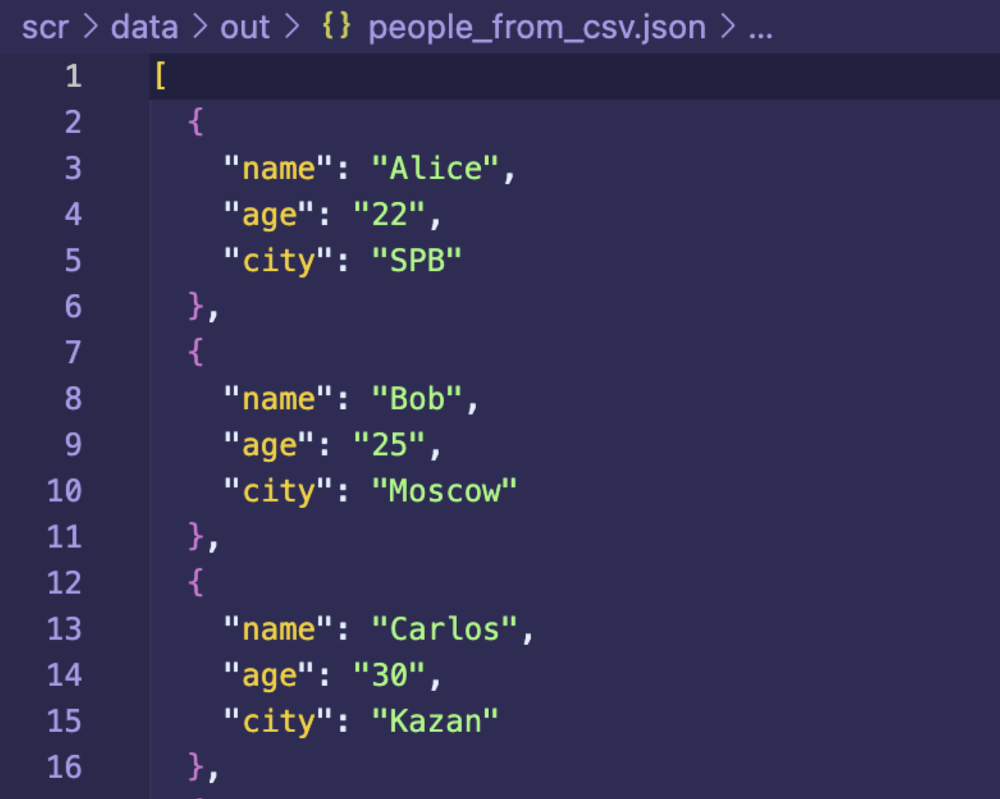
## Задание B
```
from pathlib import Path
from openpyxl import Workbook

def csv_to_xlsx(csv_path: str, xlsx_path: str) -> None:
    """
    Конвертирует CSV в XLSX.
    Использует openpyxl.
    Первая строка CSV — заголовок.
    Лист называется "Sheet1".
    Колонки — автоширина по длине текста (не менее 8 символов).
    """
    csv_file = Path(csv_path)
    xlsx_file = Path(xlsx_path)

    if not csv_file.is_file():
        raise FileNotFoundError(f"File {csv_path} not found")

    with csv_file.open(encoding='utf-8', newline='') as f:
        reader = csv.reader(f)
        data = list(reader)

    if len(data) == 0:
        raise ValueError("CSV file is empty")

    wb = Workbook()
    ws = wb.active
    ws.title = "Sheet1"

    for row in data:
        ws.append(row)

    for col_idx, col_cells in enumerate(ws.columns, start=1):
        max_length = max(len(str(cell.value)) if cell.value is not None else 0 for cell in col_cells)
        adjusted_width = max(max_length, 8)
        col_letter = ws.cell(row=1, column=col_idx).column_letter
        ws.column_dimensions[col_letter].width = adjusted_width

    wb.save(xlsx_file)
    
csv_to_xlsx('scr/data/samples/people.csv', 'scr/data/out/people.xlsx')
```
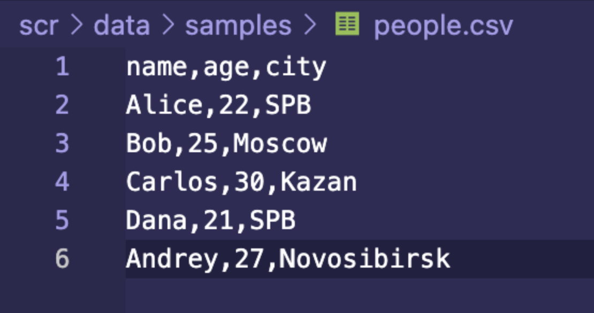
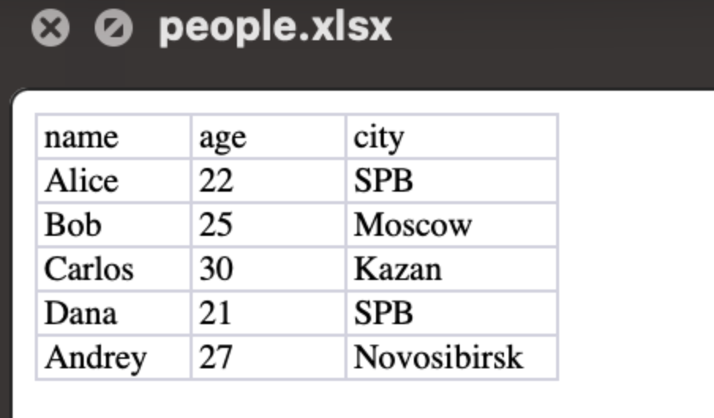
# **Лабораторная работа 6**
## Cli_text
```
import argparse
from pathlib import Path
from src.lib.text import tokenize, count_freq, top_n

def main():
    parser = argparse.ArgumentParser(description="CLI-утилиты лабораторной №6")
    subparsers=parser.add_subparsers(dest="command", help="Доступные соманды")

    stats_parser = subparsers.add_parser("stats",help="Частоты слов в тексте")
    stats_parser.add_argument("--input", required=True, help="Входной текстовый файл")
    stats_parser.add_argument("--top", type=int,default=5,help="Количество топовых слов "
    "(по умолчанию: 5)")

    cat_parser=subparsers.add_parser("cat", help="Вывод содержимого файла")
    cat_parser.add_argument("--input", required=True, help="Путь к входному файлу")
    cat_parser.add_argument("-n",action="store_true", help="Нумеровать строки")

    args = parser.parse_args()

    file=Path(args.input)

    if not file.exists():
        raise FileNotFoundError("Файл не найден")


    if args.command == "cat":

        with open(file, "r", encoding="utf-8") as f:
            number=1
            for row in f:
                row = row.rstrip("\n")
                if args.n:
                    print(f"{number} : {row}")
                    number+=1
                else:
                    print(row)

    elif args.command == "stats":

        with open(file, "r", encoding="utf-8") as f:
            data=[row for row in f]
        data = "".join(data)
        tokens = tokenize(text=data)
        freq = count_freq(tokens=tokens)
        top=top_n(freq=freq, n = args.top)

        number=1
        for x, y in top:
            print(f"{number}. {x} - {y}")
            number+=1
if __name__ == "__main__":
    main()
```
## Cli_convert
```
import argparse
from src.lib.json_csv import json_to_csv, csv_to_json
from src.lib.csv_xlsx import csv_to_xlsx

def main():
    parser = argparse.ArgumentParser(description="Конвертер данных между форматами")
    subparsers = parser.add_subparsers(dest="command", help="Доступные команды конвертации")

    json_to_csv_parser = subparsers.add_parser("json_to_csv", help="Конвертировать JSON в CSV")
    json_to_csv_parser.add_argument("--in", dest = "input", required= True, help="Входной JSON файл")
    json_to_csv_parser.add_argument("--out", dest = "output", required = True, help="Выходной CSV файл")


    csv_to_json_parser = subparsers.add_parser("csv_to_json", help="Конвертировать CSV в JSON")
    csv_to_json_parser.add_argument("--in", dest="input", required=True, help="Входной CSV файл")
    csv_to_json_parser.add_argument("--out", dest="output", required=True, help="Выходной JSON файл")

    csv_to_xlsx_parser = subparsers.add_parser("csv_to_xlsx", help="Конвертировать CSV в XLSX")
    csv_to_xlsx_parser.add_argument("--in", dest="input", required=True, help="Входной CSV файл")
    csv_to_xlsx_parser.add_argument("--out", dest="output", required=True, help="Выходной XLSX файл")

    args = parser.parse_args()

    if args.command == "json_to_csv":
        json_to_csv(json_path=args.input, csv_path=args.output)

    elif  args.command == "csv_to_json":
        csv_to_json(csv_path=args.input, json_path=args.output)

    elif args.command == "csv_to_xlsx":
        csv_to_xlsx(csv_path=args.input, xlsx_path=args.output)

if __name__ == "__main__":
    main()
```

